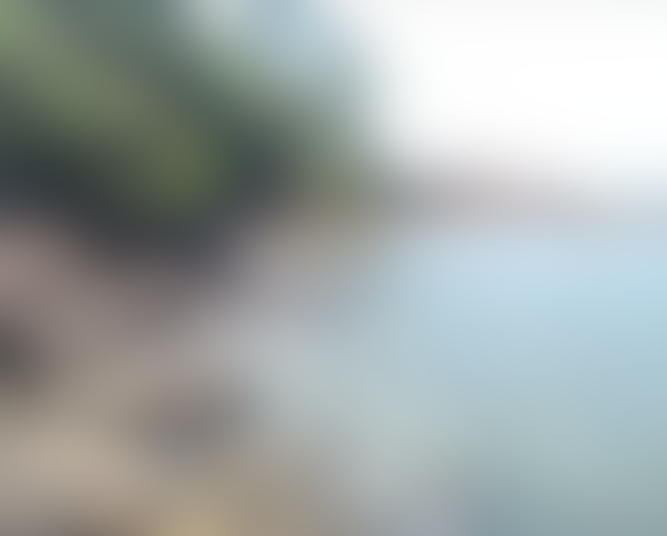
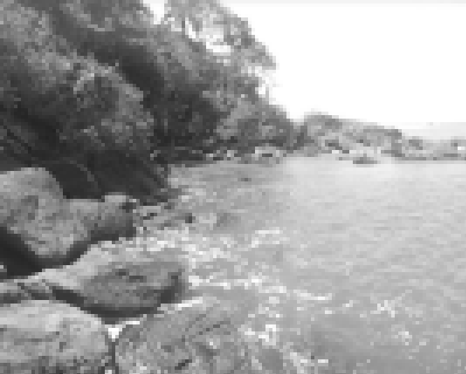
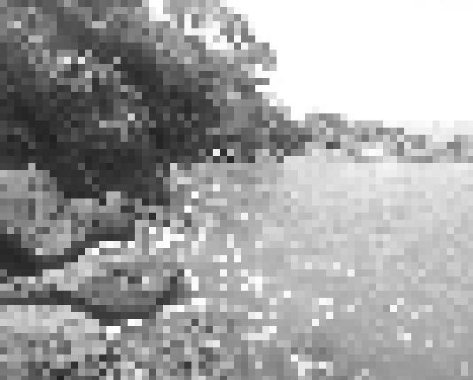
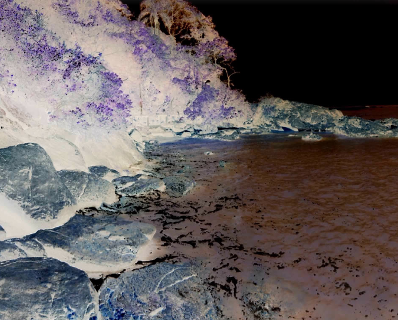

# Python-PIL-Study
 PYTHON - Aplicar filtros em imagens utilizando Pillow.

# Filters

### Blur

    
    

    Input image
    Output image

### Pixelize

    
    

    Input image
    Output image

### HOG Pixelize

    
    

    Input image
    Output image

### Negative

    
    

    Input image
    Output image

